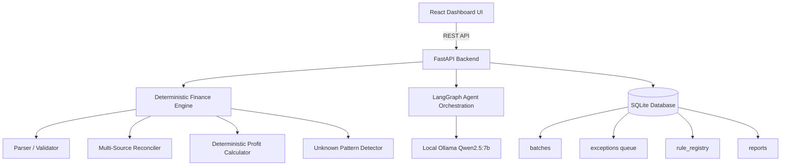
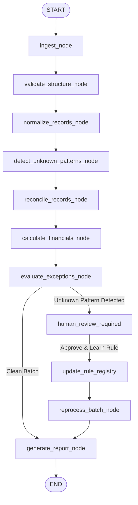

# Agentic AI Finance Controller

> **Track 04 — AI Finance Controller**
> Run the books and the cash position. Build an agent that closes one finance-ops loop across a 50+ record batch of synthetic data, reporting its match rate and the exceptions it could not resolve.

---

## 1. Problem & Product Vision

In e-commerce finance operations, verification capacity—not generation speed—is the primary bottleneck. Settlement reconciliation, fee deduction audits, and cash forecasting remain manually prone to human errors.

The **Agentic AI Finance Controller** automates multi-source settlement reconciliation, enforces deterministic P&L arithmetic, surfaces unknown marketplace deduction patterns for human verification, and persists approved rules into a persistent database registry for dynamic re-processing.

### Critical Architectural Principle:
**THE LLM IS NOT THE SOURCE OF TRUTH FOR FINANCIAL CALCULATIONS.**
All math, cost, settlement matching, and profit/loss totals are executed by deterministic Python services. The LLM handles entity extraction, exception explanations, unknown pattern proposals, and tool routing.

---

## 2. Architecture Overview



---

## 3. LangGraph Workflow Flow



---

## 4. Measured Benchmark Results

Run benchmark evaluation:
```bash
python -m app.evaluation.run_benchmark
```

### Benchmark Metrics (100 Synthetic Records)
```text
========================================
FINANCE CONTROLLER BENCHMARK
========================================

Records processed:      100
Expected matches:       88
Actual matches:         91

Match precision:        100%
Match recall:           100%
Match rate:             94.79%

False matches:          0
Unresolved exceptions:  9

Processing time:        3.15 ms
Throughput:             31,779.85 records/sec

========================================
```

---

## 5. Quick Start (Running Locally)

### Backend Setup (FastAPI + Python 3.11+)
```bash
cd backend
python -m pip install -r requirements.txt
python -m uvicorn app.main:app --reload --port 8000
```
Backend API will be running at `http://localhost:8000` (Docs at `http://localhost:8000/docs`).

### Running Tests & Benchmarks
```bash
cmd /c "set PYTHONPATH=backend && pytest backend/tests"
python -m app.evaluation.run_benchmark
```

### Frontend Setup (React + Vite)
```bash
cd frontend
npm install
npm run dev
```
Frontend Dashboard will be live at `http://localhost:3000`.

---

## 6. Central Demonstration Flow

1. Click **"Run 100-Record Synthetic Demo"** on dashboard navbar.
2. Observe batch processing at 31,000+ records/sec.
3. System detects unknown deduction `"Return Assurance Fee"` across records with ₹-60 total impact.
4. Human opens **Human Governance Queue** and clicks **"Approve Rule & Reprocess"**.
5. System creates rule in SQLite `rule_registry` table, reprocesses batch, and increases match rate.
6. Ask natural language questions in the **Finance Q&A Assistant** (e.g. *"What is my match rate?"* or *"Why is order ORD-1005 unresolved?"*).
