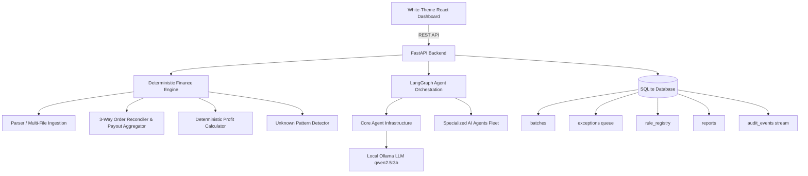
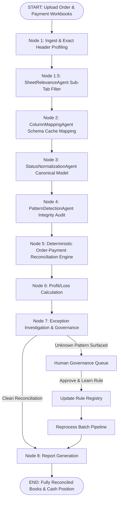

# Agentic AI Finance Controller

> **Track 04 — AI Finance Controller**
> Run the books and the cash position. Build an autonomous agent fleet that closes the finance-ops loop across multi-source marketplace spreadsheets, reporting exact reconciliation match rates, aggregated net payouts, and surfacing unknown financial exceptions for human governance.

---

## 1. Problem & Product Vision

In e-commerce finance operations, verification capacity—not generation speed—is the primary bottleneck. Settlement reconciliation, fee deduction audits, and cash forecasting across disparate marketplace workbooks remain manually prone to human error.

The **Agentic AI Finance Controller** automates multi-source settlement reconciliation, enforces deterministic P&L arithmetic, surfaces unknown marketplace deduction patterns for human verification, and persists approved rules into a persistent database registry for dynamic re-processing.

### Critical Architectural Principle:
**THE LLM IS NOT THE SOURCE OF TRUTH FOR FINANCIAL CALCULATIONS.**
All math, unit cost calculations, multi-event payout aggregations, and 3-way order matching are executed by deterministic Python services. The LLM handles entity extraction, schema mapping, status categorization, sub-tab relevance classification, exception explanations, and natural language Q&A tool routing.

---

## 2. Architecture Overview



### Modular Backend Package Layout (`backend/app/agents/`):

- **`core/`**: Core infrastructure (`llm_factory`, `state`, `prompts`, `tools`).
- **`specialized/`**: Autonomous AI Reasoning Agents (`SheetRelevanceAgent`, `ColumnMappingAgent`, `StatusNormalizationAgent`, `PatternDetectionAgent`).
- **`nodes/`**: Pipeline Graph Execution Nodes (Node 1 Ingest ──▶ Node 8 Report Generation).

---

## 3. Autonomous AI Agentic Pipeline Flow



---

## 4. Key Features & Capabilities

1. **Multi-File & Multi-Sheet Dataset Ingestion**:
   - Ingest multiple Master Order Manifests and Payment Settlement Workbooks (`.xlsx`, `.csv`, `.zip`) simultaneously.
   - Preserves multi-event payout lines per order across monthly sheets.

2. **SheetRelevanceAgent (Node 1.5)**:
   - Intelligently filters out empty disclaimer tabs (0 rows) and isolated ad summary notes while retaining essential payment settlement workbooks.

3. **Deterministic 3-Way Order Reconciliation (Node 5)**:
   - Aggregates multi-event settlement payouts per `order_id` to compute exact **Net Settlement Payout Amount**.
   - Classifies records into **Matched**, **Missing in Payment (Unsettled)**, and **Historical Payment** lines.

4. **Real-time Live Agent Audit Streaming**:
   - Streams live execution logs from `audit_events` directly to the white-themed Terminal Console UI (`GET /api/batches/{id}/logs`).

5. **Human-in-the-Loop Financial Governance**:
   - Surfaces unclassified fee deductions for human review. Approved rules are learned and persisted in SQLite.

---

## 5. Measured Benchmark Results

Run benchmark evaluation:
```bash
python -m app.evaluation.run_benchmark
```

### Benchmark Metrics (100 Synthetic Records)
```text
========================================
FINANCE CONTROLLER BENCHMARK
========================================

Records processed:      100
Expected matches:       88
Actual matches:         91

Match precision:        100%
Match recall:           100%
Match rate:             94.79%

False matches:          0
Unresolved exceptions:  9

Processing time:        3.15 ms
Throughput:             31,779.85 records/sec

========================================
```

---

## 6. Quick Start (Running Locally)

### Prerequisites:
- Python 3.11+
- Node.js 18+
- [Ollama](https://ollama.com/) with model `qwen2.5:3b` (`ollama run qwen2.5:3b`)

### Backend Setup (FastAPI):
```bash
cd backend
python -m pip install -r requirements.txt
python -m uvicorn app.main:app --reload --port 8000
```
Backend API will run at `http://localhost:8000` (Docs at `http://localhost:8000/docs`).

### Running Backend Unit Tests:
```bash
cmd /c "set PYTHONPATH=backend && pytest backend/tests"
```

### Frontend Setup (React + Vite):
```bash
cd frontend
npm install
npm run dev
```
Frontend Dashboard will run live at `http://localhost:3000`.

---

## 7. Interactive Demonstration Flow

1. Open **http://localhost:3000** in your browser.
2. Drag & drop or select your Master Order Sheet and multiple Payment Settlement files (e.g. `AgentPaymentJuly.xlsx`, `agentPaymentJune.xlsx`, `AgentPaymentMay.xlsx`).
3. Click **"Ingest & Execute AI Agents"** (or click **"Run 100-Record Synthetic Demo"**).
4. Watch the **Terminal Console** stream agent logs live as Node 1 through Node 5 complete execution.
5. Inspect the **Order Settlement Table** with aggregated Net Payouts, lifecycle status pills, and interactive search filters.
6. Open Step 5 **Governance Queue** to approve surfaced financial rules, or ask questions in Step 6 **AI Finance Controller Q&A Console**.
