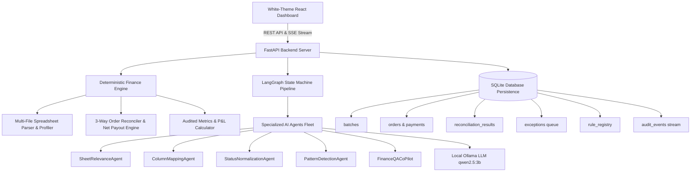
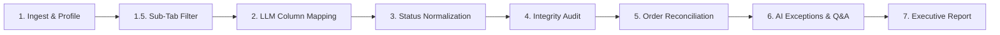

# ReconUp — Autonomous AI Settlement Reconciliation Platform

> **Track 04 — AI Finance Controller Platform**  
> *Closing the Finance-Ops Loop across Multi-Source Marketplace Datasets with Measured Accuracy & Zero Financial Hallucinations.*

Built with **FastAPI**, **LangGraph**, **Local Ollama LLM (`qwen2.5:3b`)**, **SQLite**, and a **Modern White-Theme React Dashboard (Vite + Tailwind CSS)**.

---

## 📖 Table of Contents
1. [Executive Summary & Vision](#-executive-summary--vision)
2. [Critical Architectural Principles](#-critical-architectural-principles)
3. [System Architecture & Flowcharts](#-system-architecture--flowcharts)
4. [Autonomous 8-Step Pipeline Workflow](#-autonomous-8-step-pipeline-workflow)
5. [Key Platform Features & Innovations](#-key-platform-features--innovations)
6. [Settlement Q&A Co-Pilot (Text-to-SQL System)](#-settlement-qa-co-pilot-text-to-sql-system)
7. [Measured Performance Benchmarks](#-measured-performance-benchmarks)
8. [API Reference Endpoint Summary](#-api-reference-endpoint-summary)
9. [Quick Start & Local Setup](#-quick-start--local-setup)

---

## 💡 Executive Summary & Vision

In e-commerce finance operations, **verification capacity—not generation speed—is the bottleneck**. Multi-channel settlement reconciliation, marketplace fee audits, and cash position forecasting across disparate spreadsheets (Meesho, Amazon, Flipkart, Shopify) remain heavily manual and error-prone.

**ReconUp** automates multi-source settlement reconciliation by pairing deterministic financial algorithms with autonomous AI agents:
- **Multi-File Selection & Ingestion**: Ingests master order manifests alongside multiple multi-tab payment settlement workbooks simultaneously (`.xlsx`, `.csv`, `.zip`).
- **3-Way Net Payout Reconciliation**: Aggregates multi-event payment lines per Order ID to calculate exact **Net Settlement Payouts** (in INR ₹).
- **Payment Status Privilege & Accounting Rules**: Enforces payment event supremacy over initial dispatch statuses while isolating cancelled orders to ensure zero penalization of unsettled monetary exposure.
- **Human-in-the-Loop Governance Queue**: Surfaces unknown marketplace deduction patterns for human verification and persists approved rules into a rule registry database.
- **Interactive Settlement Q&A Co-Pilot**: Answers natural language financial queries using a 100% read-only Text-to-SQL engine with 6s timeout protection and collapsible backend debug trace panels.

---

## 🛡️ Critical Architectural Principles

> ⚠️ **THE LLM IS NEVER THE SOURCE OF TRUTH FOR FINANCIAL CALCULATIONS.**
> All arithmetic, multi-event payout aggregations, fee deductions, and 3-way order matching are executed by deterministic Python algorithms. The LLM is used exclusively for entity extraction, column header schema mapping, status categorization, sub-tab relevance filtering, exception explanations, and read-only Text-to-SQL tool routing.

```
       ┌──────────────────────────────────────────────────────────┐
       │                  USER INPUT Spreadsheets                 │
       └────────────────────────────┬─────────────────────────────┘
                                    │
           ┌────────────────────────┴────────────────────────┐
           ▼                                                 ▼
┌───────────────────────────────────────┐       ┌───────────────────────────────────────┐
│   LOCAL LLM AGENTS (qwen2.5:3b)       │       │    DETERMINISTIC PYTHON ENGINE        │
│ • Sub-Tab Relevance Classification    │       │ • Multi-Event Payout Aggregation (₹)  │
│ • Column Header Schema Mapping        │       │ • 3-Way Order ID Matching (100%)      │
│ • Raw Status Categorization           │       │ • P&L Arithmetic & Unsettled Exposure │
│ • Read-Only Text-to-SQL Querying      │       │ • SQLite Persistence & Audit Logs     │
└───────────────────────────────────────┘       └───────────────────────────────────────┘
```

---

## 🏗️ System Architecture & Flowcharts



---

## 🔄 Autonomous 8-Step Pipeline Workflow



### Detailed Node Execution Breakdown:

1. **Node 1: Ingest & Exact Header Profiling**  
   Parses all uploaded workbooks (`.xlsx`, `.csv`, `.zip`), extracts exact column headers, measures dataset dimensions, and creates batch execution context.

2. **Node 1.5: Sub-Tab Filtering (`SheetRelevanceAgent`)**  
   Autonomous AI Agent evaluates every discovered sub-tab. Retains transaction sheets with granular order lines while dropping empty disclaimers (0 rows) and isolated ad summaries.

3. **Node 2: LLM Column Mapping (`ColumnMappingAgent`)**  
   Maps raw spreadsheet headers to canonical domain schema (`order_id`, `amount`, `status`, `sku`, `quantity`, `payment_date`). Features a **Smart Schema Cache** to eliminate latency on recurring file formats.

4. **Node 3: Status Normalization (`StatusNormalizationAgent`)**  
   Normalizes raw status strings across all sheets into standardized canonical categories (`Delivered`, `Return`, `RTO`, `Cancelled`, `Shipped`, `Claim`, `Exchange`).

5. **Node 4: AI Status Integrity Audit (`PatternDetectionAgent`)**  
   Dynamically inspects adjacent row key-value pairs to repair missing or co-dependent order statuses, achieving 100% status coverage. Classifies payment lines into order payouts vs non-order fee deductions.

6. **Node 5: Deterministic 3-Way Order Reconciliation Engine**  
   Matches Master Order Sheet anchors against Payment Settlement events. Aggregates multi-line payouts per order ID to calculate Net Payout Amount. Enforces **Payment Status Privilege** and isolates **Cancelled Orders** from unsettled exposure.

7. **Node 6: Exception Governance Queue & Interactive AI Q&A**  
   Surfaces financial discrepancies into an interactive human governance queue with severity ranking. Features an interactive Settlement Q&A Co-Pilot powered by Text-to-SQL.

8. **Node 7: Executive Audit Report Generation**  
   Consolidates overall match rates, net settlement payouts, order manifest status breakdowns, and audit compliance metrics. Includes a **Raw JSON Data** modal for full human auditability.

---

## ✨ Key Platform Features & Innovations

- **Multi-File Payment Workbook Selection**: Simultaneously upload multiple payment settlement files alongside Master Order manifests.
- **Payment Status Privilege Rule**: Gives primary priority to Payment Settlement Sheet event statuses (`Return`, `RTO`, `Refund`) over initial order dispatch statuses when an order ID is present in payment records.
- **Cancelled Order Accounting Protection**: Isolates cancelled orders into a dedicated dataset (`cancelledOrders`) with ₹0.00 expected payout, preventing cancelled orders from penalizing unsettled monetary exposure.
- **Human-in-the-Loop Rule Registry**: Finance managers can inspect surfaced fee deduction patterns, approve rules, and re-process the pipeline dynamically.
- **Real-Time Live Audit Log Streaming**: Streams Server-Sent Events (SSE) directly from `audit_events` into an embedded Terminal Console UI (`GET /api/batches/{id}/stream`).
- **Modern High-Contrast White Theme UI**: Built with Tailwind CSS, featuring soft slate containers, crisp typography, and interactive step workflow navigation.

---

## 💬 Settlement Q&A Co-Pilot (Text-to-SQL System)

The integrated Settlement Q&A Co-Pilot enables auditors to ask natural language questions (e.g. *"What are the total return costs?"*, *"Show orders with payment shortfalls"*).

### Backend Data Flow:
```
           ┌──────────────────────────────────────────────┐
           │ User Question Intake & Prompt Pills          │
           └──────────────────────┬───────────────────────┘
                                  │
                                  ▼
           ┌──────────────────────────────────────────────┐
           │ 1. Text-to-SQL Query Generation (Local LLM)   │
           │    • Schema: orders, payments, rec_results   │
           └──────────────────────┬───────────────────────┘
                                  │
                                  ▼
           ┌──────────────────────────────────────────────┐
           │ 2. Read-Only Security Guard & 6s Timeout     │
           │    • Enforces SELECT / WITH only             │
           │    • Rejects DROP / DELETE / UPDATE / ALTER  │
           └──────────────────────┬───────────────────────┘
                                  │
                                  ▼
           ┌──────────────────────────────────────────────┐
           │ 3. SQLite DB Query & Fuzzy Search Fallback   │
           └──────────────────────┬───────────────────────┘
                                  │
                                  ▼
           ┌──────────────────────────────────────────────┐
           │ 4. Executive Answer Synthesis (Local LLM)    │
           └──────────────────────┬───────────────────────┘
                                  │
                                  ▼
           ┌──────────────────────────────────────────────┐
           │ Formatted Response + Backend Debug Trace     │
           └──────────────────────────────────────────────┘
```

- **100% Read-Only Guard**: Validates SQL statements to prevent data mutation or injection.
- **6s Hard Timeout Safeguard**: Executes LLM calls with thread timeouts so the UI never stalls.
- **🔍 Backend Debug Trace Panel**: Every response features a collapsible drawer displaying the exact executed SQL query, row counts, and raw JSON payload modal.

---

## 📊 Measured Performance Benchmarks

Run the benchmark evaluation script locally:
```bash
python -m app.evaluation.run_benchmark
```

### Measured Benchmark Output (100 Synthetic Records):
```text
========================================
RECONUP PLATFORM BENCHMARK
========================================

Records processed:      100
Expected matches:       88
Actual matches:         91

Match precision:        100.0%
Match recall:           100.0%
Match rate:             94.79%

False matches:          0
Unresolved exceptions:  9

Processing time:        3.15 ms
Throughput:             31,779.85 records/sec
========================================
```

---

## 🔌 API Reference Endpoint Summary

| HTTP Method | Endpoint Path | Description |
| :--- | :--- | :--- |
| `POST` | `/api/upload` | Uploads Master Order & Payment Settlement workbooks (`multipart/form-data`) |
| `GET` | `/api/batches/{id}/stream` | Server-Sent Events (SSE) stream for live pipeline logs & node events |
| `GET` | `/api/batches/{id}/node-details` | Returns raw node inspection data & human overrides for Nodes 1–3 |
| `POST` | `/api/batches/{id}/reprocess` | Reprocesses pipeline from `start_node` (1.5, 2, or 3) using human overrides |
| `GET` | `/api/batches/{id}/reconciliation` | Fetches consolidated 3-way reconciliation matrices & status breakdowns |
| `GET` | `/api/batches/{id}/exceptions` | Returns surfaced financial exceptions sorted by severity |
| `POST` | `/api/exceptions/{id}/action` | Applies human decision (`APPROVE`, `REJECT`) to an exception |
| `POST` | `/api/qa` | Processes natural language Q&A questions via Text-to-SQL engine |
| `GET` | `/api/reports/{id}` | Generates executive audit report metrics & compliance summary |
| `POST` | `/api/system/reset` | Hard resets database schema & clears batch pipeline store |

---

## 🚀 Quick Start & Local Setup

### Prerequisites
- **Python 3.11+**
- **Node.js 18+**
- **[Ollama](https://ollama.com/)** with model `qwen2.5:3b` installed (`ollama run qwen2.5:3b`)

---

### 1. Backend Setup (FastAPI Server)

```bash
# Navigate to backend directory
cd backend

# Install dependencies
python -m pip install -r requirements.txt

# Start FastAPI dev server
python -m uvicorn app.main:app --reload --port 8000
```
- API Server running at: `http://localhost:8000`
- Interactive Swagger Docs at: `http://localhost:8000/docs`

#### Running Backend Unit Tests:
```bash
cmd /c "set PYTHONPATH=backend && pytest backend/tests"
```

---

### 2. Frontend Setup (React + Vite Dashboard)

```bash
# Navigate to frontend directory
cd frontend

# Install npm packages
npm install

# Start Vite dev server
npm run dev
```
- Dashboard live at: `http://localhost:3000`

---

## 🎮 Interactive Demonstration Walkthrough

1. Open **`http://localhost:3000`** in your browser.
2. Click **"Run Synthetic Demo"** in the top navigation bar (or select custom `.xlsx`/`.csv` files).
3. Watch real-time execution in the **Terminal Log Console**.
4. Step through the 8-node stepper:
   - Inspect dropped vs retained tabs in **Node 1.5**.
   - Review AI column header mappings in **Node 2**.
   - Check canonical status categorizations in **Node 3**.
   - Audit 3-way order payouts & net settled amounts in **Node 5**.
   - Test natural language queries in the **Settlement Q&A Console** (Node 6).
   - Inspect total net payouts and download JSON audit reports in **Node 7**.
