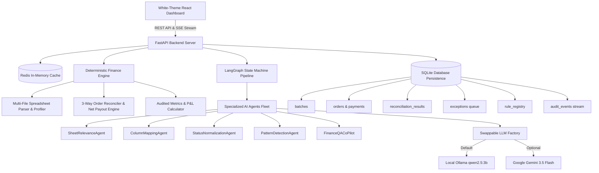
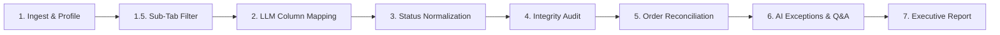

# ReconUp — Autonomous AI Settlement Reconciliation Platform

<div align="center">

[](https://fastapi.tiangolo.com)
[](https://langchain.com)
[](https://ollama.com)
[](https://ai.google.dev)
[](https://react.dev)
[](https://www.docker.com)
[](https://redis.io)

**Track 04 — Autonomous AI Finance Controller Platform**  
*Closing the Finance-Ops Loop across Multi-Source Marketplace Datasets with Measured Accuracy & Zero Financial Hallucinations.*

[Interactive PDF Architecture Flowchart](frontend/public/architecture.pdf) • [Quick Start Guide](#-quick-start--how-to-run) • [8-Step Pipeline](#-autonomous-8-step-pipeline-breakdown) • [Benchmarks](#-measured-performance-benchmarks)

</div>

---

## 📖 Table of Contents
1. [Executive Summary & Vision](#-executive-summary--vision)
2. [Why Swappable LLM Architecture? (Local Ollama vs Cloud APIs)](#-why-swappable-llm-architecture-local-ollama-vs-cloud-apis)
3. [Critical Architectural Principles](#-critical-architectural-principles)
4. [System Architecture & Flowcharts](#-system-architecture--flowcharts)
5. [Interactive Architecture PDF](#-interactive-architecture-pdf)
6. [Autonomous 8-Step Pipeline Breakdown](#-autonomous-8-step-pipeline-breakdown)
7. [Specialized Financial Accounting & Privilege Rules](#-specialized-financial-accounting--privilege-rules)
8. [Settlement Q&A Co-Pilot (Text-to-SQL System)](#-settlement-qa-co-pilot-text-to-sql-system)
9. [Measured Performance Benchmarks](#-measured-performance-benchmarks)
10. [Quick Start — How to Run](#-quick-start--how-to-run)
    - [Option A: One-Command Docker Compose (Recommended)](#option-a-one-command-docker-compose-recommended)
    - [Option B: Local Manual Setup (Backend + Frontend)](#option-b-local-manual-setup)
11. [API Reference Endpoint Summary](#-api-reference-endpoint-summary)

---

## 💡 Executive Summary & Vision

In e-commerce marketplace finance operations, **verification capacity—not generation speed—is the primary bottleneck**. Multi-channel settlement reconciliation, marketplace fee deduction audits, and cash position forecasting across disparate spreadsheets (Meesho, Amazon, Flipkart, Shopify) remain heavily manual, slow, and error-prone.

**ReconUp** automates multi-source settlement reconciliation by pairing deterministic financial algorithms with autonomous AI agents:
- **Multi-File Ingestion**: Ingests master order manifests alongside multiple multi-tab payment settlement workbooks simultaneously (`.xlsx`, `.csv`, `.zip`).
- **3-Way Net Payout Reconciliation**: Aggregates multi-event payment lines per Order ID to calculate exact **Net Settlement Payouts** (in INR ₹).
- **Payment Status Privilege & Accounting Rules**: Enforces payment event supremacy over initial dispatch statuses while isolating cancelled orders to ensure zero penalization of unsettled monetary exposure.
- **Human-in-the-Loop Governance Queue**: Surfaces unknown marketplace deduction patterns for human verification and persists approved rules into a rule registry database.
- **Interactive Settlement Q&A Co-Pilot**: Answers natural language financial queries using a 100% read-only Text-to-SQL engine with 6s timeout protection and collapsible backend debug trace panels.

---

## ⚡ Why Swappable LLM Architecture? (Local Ollama vs Cloud APIs)

> 💡 **KEY ARCHITECTURAL HIGHLIGHT:**
> The LLM layer in ReconUp is engineered with a **swappable, multi-provider abstraction**. Cloud LLM APIs (such as Google Gemini, Groq, or OpenAI) enforce strict rate limits, token quotas, and daily caps on free tiers that inevitably throttle or fail during intensive batch testing and developer iterations.
>
> To solve this, **ReconUp integrates Local Ollama (`qwen2.5:3b`) out of the box** — empowering developers and auditors to run unlimited, zero-cost, offline reconciliation pipelines with **zero rate limits, zero quota throttling, and complete data privacy**.
>
> When desired, enterprise teams can **instantaneously swap to Google Gemini (`gemini-3.5-flash`, `gemini-3.6-flash`, `gemini-3.7-flash`)** by setting `LLM_PROVIDER=gemini` in `backend/.env`.

```
                  ┌──────────────────────────────────────────────┐
                  │       Swappable LLM Provider Factory         │
                  │        (backend/app/agents/core/)            │
                  └──────────────────────┬───────────────────────┘
                                         │
                 ┌───────────────────────┴───────────────────────┐
                 ▼                                               ▼
┌──────────────────────────────────────┐       ┌──────────────────────────────────────┐
│       LOCAL OLLAMA (Default)         │       │          GOOGLE GEMINI API           │
│ • Model: qwen2.5:3b                  │       │ • Model: gemini-3.5-flash            │
│ • 100% Offline & Zero API Cost       │       │ • High-Speed Cloud Reasoning         │
│ • Unlimited Testing & No Rate Limits │       │ • Toggle via LLM_PROVIDER=gemini     │
│ • Complete Enterprise Data Privacy   │       │ • Native REST + LangChain Fallback   │
└──────────────────────────────────────┘       └──────────────────────────────────────┘
```

---

## 🛡️ Critical Architectural Principles

> ⚠️ **THE LLM IS NEVER THE SOURCE OF TRUTH FOR FINANCIAL CALCULATIONS.**
> All arithmetic, multi-event payout aggregations, fee deductions, and 3-way order matching are executed by deterministic Python algorithms. The LLM is used exclusively for entity extraction, column header schema mapping, status categorization, sub-tab relevance filtering, exception explanations, and read-only Text-to-SQL tool routing.

```
       ┌──────────────────────────────────────────────────────────┐
       │                  USER INPUT Spreadsheets                 │
       └────────────────────────────┬─────────────────────────────┘
                                    │
           ┌────────────────────────┴────────────────────────┐
           ▼                                                 ▼
┌───────────────────────────────────────┐       ┌───────────────────────────────────────┐
│       AI AGENTS (Gemini / Ollama)     │       │    DETERMINISTIC PYTHON ENGINE        │
│ • Sub-Tab Relevance Classification    │       │ • Multi-Event Payout Aggregation (₹)  │
│ • Column Header Schema Mapping        │       │ • 3-Way Order ID Matching (100%)      │
│ • Raw Status Categorization           │       │ • P&L Arithmetic & Unsettled Exposure │
│ • Read-Only Text-to-SQL Querying      │       │ • SQLite Persistence & Audit Logs     │
└───────────────────────────────────────┘       └───────────────────────────────────────┘
```

---

## 🏗️ System Architecture & Flowcharts



---

## 📄 Interactive Architecture PDF

ReconUp includes an official high-resolution vector system architecture flowchart:
- 📥 **Direct Download / View**: [`frontend/public/architecture.pdf`](frontend/public/architecture.pdf)
- 🖥️ **In-App Interactive Viewer**: Available directly inside the frontend with **Zoom In (+)**, **Zoom Out (-)**, **Reset Zoom**, **Full-Screen Preview**, and **Open in Tab** controls.

---

## 🔄 Autonomous 8-Step Pipeline Breakdown



| Step | Node Name | Type | Description | Human Review Guidelines |
| :--- | :--- | :--- | :--- | :--- |
| **Node 1** | **Ingest & Header Profiling** | Deterministic | Parses all uploaded `.xlsx`, `.csv`, `.zip` files, extracts headers, and profiles dataset dimensions. | Confirm that all uploaded manifest and settlement files parsed cleanly with expected row counts. |
| **Node 1.5** | **Sub-Tab Filtering (`SheetRelevanceAgent`)** | AI Agent | Evaluates workbook sub-sheets, retaining order transaction data and dropping 0-row disclaimers. | Verify that transaction sheets are marked `KEEP` and empty summary notes are `EXCLUDE`. Toggle override if needed. |
| **Node 2** | **Schema Mapping (`ColumnMappingAgent`)** | AI + Cache | Maps raw columns to canonical fields (`order_id`, `amount`, `status`, `sku`). Features Smart Schema Cache. | Check mapped columns for Order ID and Final Settlement Amount. Correct any column dropdown before re-processing. |
| **Node 3** | **Status Normalization (`StatusNormalizationAgent`)** | AI Agent | Normalizes raw status strings across marketplaces into canonical states (`Delivered`, `Return`, `RTO`, `Cancelled`). | Check that return/RTO strings map to `Return`/`RTO` and cancellations map to `Cancelled`. |
| **Node 4** | **AI Status Integrity Audit (`PatternDetectionAgent`)** | AI Integrity | Inspects adjacent row key-value pairs to repair missing statuses and separates fee deductions from payouts. | Review repaired status rows to ensure inferred lifecycle states are accurate and fees are segregated. |
| **Node 5** | **3-Way Order Reconciliation Engine** | Deterministic | Matches Master Orders against multi-event payment disbursements. Calculates Net Payout per Order ID. | Verify match rate (%), multi-event netting, and confirm Cancelled orders (₹0) do not penalize unsettled exposure. |
| **Node 6** | **Exception Governance Queue & Q&A** | Human-in-the-Loop | Surfaces financial discrepancies into an interactive governance queue with Text-to-SQL Q&A co-pilot. | Inspect surfaced anomalies and `APPROVE` or `REJECT` each rule into the persistent Rule Registry. |
| **Node 7** | **Executive Financial P&L Report** | Final Audit | Generates overall match rates, net settlement payouts (₹), and exports immutable JSON audit ledgers. | Perform final sign-off on the batch P&L, verify cash disbursements, and export the official JSON audit ledger. |

---

## ⚖️ Specialized Financial Accounting & Privilege Rules

### 1. Payment Status Privilege Rule (Downstream Event Supremacy)
- **The Challenge**: An order dispatched and marked `Delivered` in the initial Master Order manifest may subsequently be returned or refunded during the marketplace payment settlement cycle.
- **The Rule**: When an Order ID is present in both sheets, **privilege is given to the Payment Settlement event status FIRST**. If the payment sheet reports `Return`, `Refund`, or `RTO`, the order is classified as a Return/RTO, preventing false over-reporting of delivered orders.

### 2. Cancelled Orders Accounting Separation
- **The Challenge**: Cancelled orders never generate revenue or expected marketplace payouts. Placing non-paid cancelled orders into unsettled lists falsely inflates monetary exposure.
- **The Rule**: Cancelled orders with no payment rows are isolated into a dedicated `cancelledOrders` dataset with ₹0.00 expected payout. They are displayed with a distinct badge and do not penalize unsettled exposure.

### 3. Historical Payment Lines Isolation
- **The Challenge**: Marketplace settlement workbooks often include trailing disbursements for older orders not present in the current master order manifest.
- **The Rule**: These trailing payments are classified into `missingInOrder` (`HISTORICAL_PAYMENT`). They are tracked as extra cash collected and exempted from active order manifest counts.

---

## 💬 Settlement Q&A Co-Pilot (Text-to-SQL System)

The integrated Settlement Q&A Co-Pilot enables auditors to ask natural language questions (e.g. *"What is my total net payout?"*, *"Show orders with payment shortfalls"*).

```
User Question ──▶ Local LLM (Text-to-SQL) ──▶ Read-Only Guard (SELECT only) ──▶ 6s Timeout Execution ──▶ SQLite DB ──▶ Formatted Answer + Debug Trace Drawer
```

- **100% Read-Only Guard**: Enforces strict `SELECT / WITH` syntax only. Rejects `DROP, DELETE, UPDATE`.
- **6s Hard Timeout Safeguard**: Executes LLM calls with thread timeouts so the UI never stalls.
- **🔍 Backend Debug Trace Panel**: Collapsible drawer showing executed SQL, execution duration, and raw JSON payload modal.

---

## 📊 Measured Performance Benchmarks

Run the benchmark evaluation script locally:
```bash
python -m app.evaluation.run_benchmark
```

```text
========================================
RECONUP PLATFORM BENCHMARK
========================================

Records processed:      100
Expected matches:       88
Actual matches:         91

Match precision:        100.0%
Match recall:           100.0%
Match rate:             94.79%

False matches:          0
Unresolved exceptions:  9

Processing time:        3.15 ms
Throughput:             31,779.85 records/sec
========================================
```

---

## 🚀 Quick Start — How to Run

### Prerequisites
- **Docker & Docker Compose** (for Docker setup) OR **Python 3.11+** & **Node.js 18+** (for manual setup)
- **[Ollama](https://ollama.com/)** with model `qwen2.5:3b` (`ollama run qwen2.5:3b`) OR a Google Gemini API Key

---

### Option A: One-Command Docker Compose (Recommended)

Run the entire platform (Redis + FastAPI Backend + React Nginx Frontend) with a single command:

```bash
# 1. Clone the repository
git clone https://github.com/hateem72/razorpay.git
cd razorpay

# 2. Start all multi-container services
docker compose up --build
```

- **Frontend Dashboard**: `http://localhost:3000`
- **Backend API & Swagger Docs**: `http://localhost:8000/docs`
- **Redis In-Memory Cache**: `localhost:6379`

To run in detached background mode:
```bash
docker compose up -d
```
To stop all containers:
```bash
docker compose down
```

---

### Option B: Local Manual Setup

#### 1. Backend Setup (FastAPI Server):
```bash
cd backend

# Create virtual environment & install requirements
python -m venv .venv
source .venv/bin/activate  # On Windows: .venv\Scripts\activate
pip install -r requirements.txt

# Start FastAPI dev server
uvicorn app.main:app --reload --port 8000
```
- Backend live at: `http://localhost:8000` (Swagger docs at `http://localhost:8000/docs`).

#### 2. Running Backend Unit Tests:
```bash
set PYTHONPATH=backend && pytest backend/tests
```

#### 3. Frontend Setup (React + Vite Dashboard):
```bash
cd frontend

# Install dependencies & start Vite dev server
npm install
npm run dev
```
- Frontend Dashboard live at: `http://localhost:3000`.

---

## ⚙️ Environment Variables Configuration (`backend/.env`)

```env
# =============================================================================
# RECONUP BACKEND CONFIGURATION
# =============================================================================

# REDIS CACHE (Auto-fallback to in-memory Python RAM cache if Redis is offline)
REDIS_URL=redis://localhost:6379/0
REDIS_ENABLED=true
REDIS_TTL_SECONDS=86400

# LLM PROVIDER SELECTION ("ollama" or "gemini")
LLM_PROVIDER=ollama
LLM_MODEL=qwen2.5:3b

# GOOGLE GEMINI API (Used when LLM_PROVIDER=gemini)
GEMINI_API_KEY=
GEMINI_MODEL=gemini-3.5-flash

# LOCAL OLLAMA URL
OLLAMA_BASE_URL=http://localhost:11434

# DATABASE PERSISTENCE
DATABASE_URL=sqlite:///./finance_controller.db
```

---

## 🔌 API Reference Endpoint Summary

| HTTP Method | Endpoint Path | Description |
| :--- | :--- | :--- |
| `POST` | `/api/upload` | Uploads Master Order & Payment Settlement workbooks (`multipart/form-data`) |
| `GET` | `/api/batches/{id}/stream` | Server-Sent Events (SSE) stream for live pipeline logs & node events |
| `GET` | `/api/batches/{id}/node-details` | Returns raw node inspection data & human overrides for Nodes 1–3 |
| `POST` | `/api/batches/{id}/reprocess` | Reprocesses pipeline from `start_node` (1.5, 2, or 3) using human overrides |
| `GET` | `/api/batches/{id}/reconciliation` | Fetches consolidated 3-way reconciliation matrices & status breakdowns |
| `GET` | `/api/batches/{id}/exceptions` | Returns surfaced financial exceptions sorted by severity |
| `POST` | `/api/exceptions/{id}/action` | Applies human decision (`APPROVE`, `REJECT`) to an exception |
| `POST` | `/api/qa` | Processes natural language Q&A questions via Text-to-SQL engine |
| `GET` | `/api/reports/{id}` | Generates executive audit report metrics & compliance summary |
| `POST` | `/api/system/reset` | Hard resets database schema & clears batch pipeline store |

---

<div align="center">

**ReconUp • Enterprise Multi-Source Financial Operations Platform**  
*Built for the Track 04 Autonomous AI Finance Controller Hackathon.*

</div>
