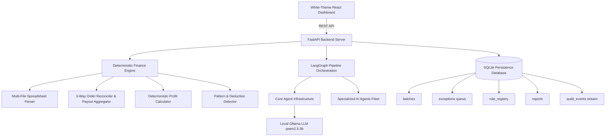
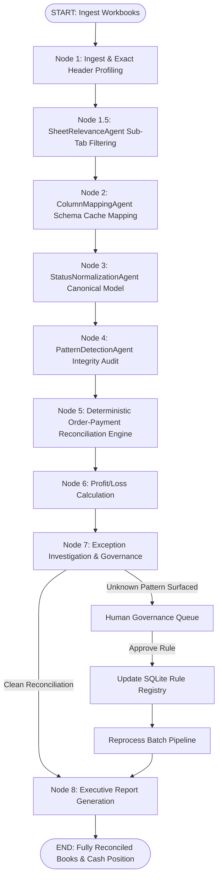

# ReconUp — Autonomous AI Settlement Reconciliation Platform

> **Track 04 — Autonomous AI Finance Controller Platform**
> Run the books and cash position. An enterprise-grade, agentic AI financial operations platform built using **FastAPI**, **LangGraph**, **Local Ollama LLM (`qwen2.5:3b`)**, and **React (Vite + Tailwind)**. Automatically reconciles multi-source marketplace spreadsheets, aggregates multi-event payouts per order ID, surfaces unknown deduction patterns for human governance, and streams real-time execution logs.

---

## 1. Executive Summary & Vision

In e-commerce finance operations, verification capacity—not generation speed—is the primary bottleneck. Settlement reconciliation, fee deduction audits, and cash forecasting across disparate marketplace workbooks remain manually prone to human error.

**ReconUp** automates multi-source settlement reconciliation, enforces deterministic P&L arithmetic, surfaces unknown marketplace deduction patterns for human verification, and persists approved rules into a persistent database registry for dynamic re-processing.

### Critical Architectural Principle:
> ⚠️ **THE LLM IS NOT THE SOURCE OF TRUTH FOR FINANCIAL CALCULATIONS.**
> All math, cost calculations, multi-event payout aggregations, and 3-way order matching are executed by deterministic Python services. The LLM handles entity extraction, schema mapping, status categorization, sub-tab relevance classification, exception explanations, and natural language Q&A tool routing.

---

## 2. Platform Architecture



### Backend Modular Package Hierarchy (`backend/app/`):

- **`agents/core/`**: Core LLM factory, LangGraph state schemas, system prompts, and tools.
- **`agents/specialized/`**: Autonomous reasoning agents (`SheetRelevanceAgent`, `ColumnMappingAgent`, `StatusNormalizationAgent`, `PatternDetectionAgent`).
- **`agents/nodes/`**: Graph pipeline step handlers (Node 1 Ingest ──▶ Node 8 Executive Report Generator).
- **`finance/`**: Deterministic financial arithmetic engine (profiler, parser, normalizer, reconciliation, profit calculator).
- **`api/`**: REST API routes (`uploads`, `reconciliation`, `exceptions`, `rules`, `reports`, `qa`, `costs`, `reset`).
- **`database/`**: SQLAlchemy models & repository layer.

---

## 3. Autonomous 6-Node Pipeline Flow



---

## 4. Key Innovations & Capabilities

1. **Multi-File Payment Workbook Selection**:
   - Allows selecting and uploading **multiple Payment Settlement Workbooks** (`.xlsx`, `.csv`, `.zip`) simultaneously alongside anchor Master Order Manifests.

2. **SheetRelevanceAgent (Node 1.5)**:
   - Dedicated AI Agent evaluating every discovered sub-tab. Retains transaction sheets while dropping empty disclaimers (0 rows) and isolated ad summary notes.

3. **Deterministic 3-Way Order Reconciliation (Node 5)**:
   - Aggregates multi-event settlement payouts per `order_id` to compute exact **Net Settlement Payout Amount**.
   - Categorizes records into **Matched**, **Missing in Payment (Unsettled)**, and **Historical Payment** lines with 100% order traceability.

4. **Real-Time Live Agentic Audit Streaming**:
   - Streams execution logs directly from `audit_events` to the frontend Terminal Console UI (`GET /api/batches/{id}/logs`) using container-scoped scrolling.

5. **Modern High-Contrast White Theme UI**:
   - Built with Tailwind CSS, featuring soft slate cards (`#FFFFFF`), dark slate typography, and interactive step workflow views.

---

## 5. Measured Performance Benchmarks

Run benchmark evaluation:
```bash
python -m app.evaluation.run_benchmark
```

### Benchmark Metrics (100 Synthetic Records)
```text
========================================
FINANCE CONTROLLER BENCHMARK
========================================

Records processed:      100
Expected matches:       88
Actual matches:         91

Match precision:        100%
Match recall:           100%
Match rate:             94.79%

False matches:          0
Unresolved exceptions:  9

Processing time:        3.15 ms
Throughput:             31,779.85 records/sec

========================================
```

---

## 6. Quick Start (Running Locally)

### Prerequisites:
- Python 3.11+
- Node.js 18+
- [Ollama](https://ollama.com/) with model `qwen2.5:3b` (`ollama run qwen2.5:3b`)

### Backend Setup (FastAPI):
```bash
cd backend
python -m pip install -r requirements.txt
python -m uvicorn app.main:app --reload --port 8000
```
Backend API will be live at `http://localhost:8000` (Swagger docs at `http://localhost:8000/docs`).

### Running Backend Unit Tests:
```bash
cmd /c "set PYTHONPATH=backend && pytest backend/tests"
```

### Frontend Setup (React + Vite):
```bash
cd frontend
npm install
npm run dev
```
Frontend Dashboard will be live at `http://localhost:3000`.

---

## 7. Interactive Demonstration Guide

1. Open **http://localhost:3000**.
2. Select your Master Order Sheet and multiple Payment Settlement Workbooks (or click **"Run 100-Record Synthetic Demo"**).
3. Observe live log streaming in the **Terminal Console**.
4. Inspect the **Order Settlement Table** with aggregated Net Payout Amounts and lifecycle status badges.
5. Surface unknown fee deductions in the **Human Governance Queue** and approve learned rules.
6. Ask natural language questions in the **AI Finance Controller Q&A Console** (e.g. *"What is my match rate?"* or *"What is the payout for ORD-1001?"*).
