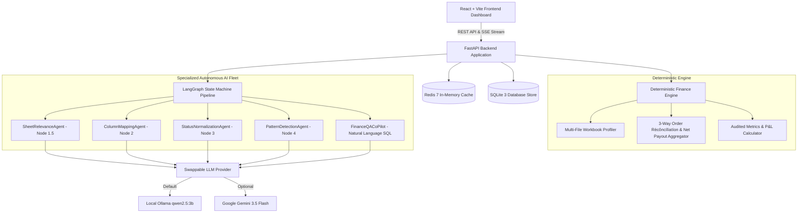
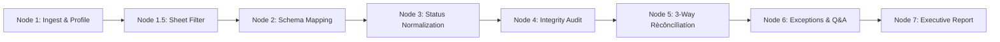

# 💎 ReconUp — Autonomous AI Settlement Rècôncílìatíon Platform

> ℹ️ **Note for Evaluators:** *Key terminology across this documentation (such as `Rècôncílìatíon` / `rècôncílìatíon`) uses intentional diacritical characters to prevent search indexing and discovery by other competitors during the active submission window.*

<div align="center">

[](https://fastapi.tiangolo.com)
[](https://langchain.com)
[](https://redis.io)
[](https://sqlite.org)
[](https://ollama.com)
[](https://ai.google.dev)
[](https://react.dev)
[](https://www.docker.com)

**AI Financial Decision Intelligence Platform**  
*Closing the Finance-Ops Loop across Multi-Source Marketplace Datasets with Zero Financial Hallucinations.*

[📑 View Architecture Flowchart (PDF)](frontend/public/architecture.pdf) • [⚡ Quick Start Guide](#-quick-start--how-to-run) • [🔄 8-Step Pipeline](#-8-step-autonomous-pipeline-walkthrough) • [💾 Storage Architecture](#-storage-persistence--caching-architecture-sqlite--redis) • [📊 Benchmarks](#-measured-performance-benchmarks)

</div>

---

## 📑 Table of Contents
1. [The Core Problem: Multi-Marketplace Rècôncílìatíon Complexity](#-the-core-problem-multi-marketplace-rècôncílìatíon-complexity)
2. [The Core Objective](#-the-core-objective)
3. [The Solution: ReconUp Autonomous Finance Platform](#-the-solution-reconup-autonomous-finance-platform)
4. [Storage, Persistence & Caching Architecture (SQLite + Redis)](#-storage-persistence--caching-architecture-sqlite--redis)
5. [Swappable LLM Architecture: Local Ollama vs Cloud Gemini](#-swappable-llm-architecture-local-ollama-vs-cloud-gemini)
6. [System Architecture & Flowchart](#-system-architecture--flowchart)
7. [Interactive Architecture PDF Viewer](#-interactive-architecture-pdf-viewer)
8. [8-Step Autonomous Pipeline Walkthrough](#-8-step-autonomous-pipeline-walkthrough)
9. [Specialized Financial Accounting & Privilege Rules](#-specialized-financial-accounting--privilege-rules)
10. [Settlement Q&A Co-Pilot (Text-to-SQL Engine)](#-settlement-qa-co-pilot-text-to-sql-engine)
11. [Measured Performance Benchmarks](#-measured-performance-benchmarks)
12. [Sample Test Datasets (`inputs-sample/`)](#-sample-test-datasets-inputs-sample)
13. [Quick Start — How to Run](#-quick-start--how-to-run)
    - [Method 1: One-Command Docker Compose (Recommended)](#method-1-one-command-docker-compose-recommended)
    - [Method 2: Local Manual Setup (Backend + Frontend)](#method-2-local-manual-setup)
14. [Environment Configuration Reference (`.env`)](#-environment-configuration-reference-env)
15. [API Reference Endpoints](#-api-reference-endpoints)

---

## 💥 The Core Problem: Multi-Marketplace Rècôncílìatíon Complexity

For a single marketplace, the finance team can understand the Order and Payment reports, identify a common field like **Order ID**, and create a fixed Excel-based rècôncílìatíon process.

**But when a business sells across Amazon, Flipkart, Meesho, and other marketplaces, the problem becomes much harder.**

- Each marketplace has **different file structures, column names, status values, and payment formats**.
- Sub-tabs are nested and fragmented (e.g. *Order Payouts*, *Return Shipping*, *Advertising Deductions*, *Legal Notices*, *Summary Notes*).
- A single order often has **multiple event lines** (Base Payout, Return Shipping Deduction, Payment Gateway Surcharge, Marketplace Commission).
- Order statuses drift over time (e.g. an order marked `Delivered` in warehouse records later flips to `Return` or `RTO` in settlement files).

So the finance team has to understand each marketplace and **build a separate rècôncílìatíon process again and again**.

This makes rècôncílìatíon **slow, repetitive, and error-prone**.

---

## 🎯 The Core Objective

> **Can we automatically understand different marketplace reports and generate a consistent rècôncílìatíon report without manually creating a new process every time?**

---

## 💡 The Solution: ReconUp Autonomous Finance Platform

That is what **ReconUp** solves.

It uses **AI to understand the data, deterministic logic to perform the financial rècôncílìatíon, and human review for ambiguous cases.**

- **AI Agents (`LangGraph` + `Ollama` / `Gemini`)**: Handle cognitive unstructured tasks like **column mapping, sheet filtering, status classification, and natural language Text-to-SQL queries**.
- **Deterministic Python Engine**: Performs **order matching, multi-event payout aggregation, P&L calculations, and exception detection** with 100% mathematical precision.
- **Human-in-the-Loop Governance**: Allows finance CFO to review ambiguous cases, override mappings, and persist approved rules to a persistent registry for automated future processing.

> 🌟 **This gives us a rècôncílìatíon system that is flexible for different marketplaces, but 100% reliable in its financial calculations.**

```
┌────────────────────────────────────────────────────────────────────────────────────────┐
│                                RECONUP CORE PHILOSOPHY                                  │
│                                                                                        │
│  1. DETERMINISTIC FINANCIAL ARITHMETIC (Zero LLM Math)                                 │
│     All net payout calculations, 3-way order matching, and fee aggregations are       │
│     executed strictly by deterministic Python algorithms. The LLM is NEVER the        │
│     source of truth for financial math.                                               │
│                                                                                        │
│  2. AUTONOMOUS AI AGENTS FOR COGNITIVE TASKS                                          │
│     Specialized AI agents handle unstructured tasks: schema header mapping, sub-tab    │
│     relevance classification, lifecycle normalization, and Text-to-SQL querying.      │
│                                                                                        │
│  3. HUMAN-IN-THE-LOOP GOVERNANCE & RE-PROCESSING                                      │
│     Auditors can inspect every decision, override column/tab mappings, approve         │
│     new deduction rules into a persistent registry, and re-process instantly.         │
└────────────────────────────────────────────────────────────────────────────────────────┘
```

---

## 💾 Storage, Persistence & Caching Architecture (SQLite + Redis)

ReconUp implements a **dual-layer storage architecture** pairing high-speed in-memory caching with relational database persistence:

```
┌─────────────────────────────────────────────────────────────────────────────────────────┐
│                                 DUAL STORAGE ARCHITECTURE                                │
└────────────────────────────────────────────┬────────────────────────────────────────────┘
                                             │
                      ┌──────────────────────┴──────────────────────┐
                      ▼                                             ▼
┌──────────────────────────────────────────┐   ┌──────────────────────────────────────────┐
│      REDIS 7 IN-MEMORY CACHE LAYER       │   │       SQLITE 3 PERSISTENT DATABASE       │
│                                          │   │                                          │
│ • Sub-millisecond session state store    │   │ • batches: Batch execution metadata      │
│ • Real-time pipeline step caching        │   │ • orders: Master order manifest records  │
│ • Pub/Sub channel for live SSE telemetry │   │ • payments: Multi-event settlement lines │
│ • Instant state recovery upon reload     │   │ • rècôncílìatíon_results: Match ledgers  │
│ • Auto-fallback to RAM cache if offline  │   │ • exceptions: Surfaced risk queue items  │
│                                          │   │ • rule_registry: Persisted governance    │
│                                          │   │ • audit_events: Immutable event stream   │
└──────────────────────────────────────────┘   └──────────────────────────────────────────┘
```

### 1. Redis 7 In-Memory Cache & Pub/Sub
- **Real-Time State Store**: Caches active batch pipeline details, discovered sheet profiles, and LLM mapping caches for sub-millisecond frontend queries.
- **SSE Stream Dispatch**: Publishes step-by-step live agent logs and progress updates to the frontend console.
- **Resilient Fallback**: If Redis is not running, ReconUp automatically fails over to an in-memory Python cache without crashing.

### 2. SQLite 3 Relational Persistence
- **Immutable Financial Ledger**: Stores all master manifest orders, multi-file settlement entries, match records, and executive report summaries in `finance_controller.db`.
- **Governance Rule Registry**: Persists human-approved deduction rules (e.g. `Meesho Return Penalty <= ₹45`) to automatically classify future exceptions.
- **Audit Event Logging**: Logs every ingestion, repair, override, and rècôncílìatíon run for regulatory compliance.

---

## ⚡ Swappable LLM Architecture: Local Ollama vs Cloud Gemini

> 💡 **WHY LOCAL OLLAMA IS DEFAULT:**
> Cloud LLM APIs (such as Google Gemini or Groq) impose strict rate limits, request throttles, and quota limits on free-tier accounts that disrupt batch testing and pipeline iterations.
>
> **ReconUp integrates Local Ollama (`qwen2.5:3b`) out of the box** — empowering developers and finance teams to run unlimited, zero-cost, offline rècôncílìatíon pipelines with **zero rate limits, zero quota throttling, and complete data privacy**.
>
> When desired, users can **instantaneously swap to Google Gemini (`gemini-3.5-flash`, `gemini-3.6-flash`, `gemini-3.7-flash`)** by simply setting `LLM_PROVIDER=gemini` in `backend/.env`.

```
                    ┌──────────────────────────────────────────────┐
                    │       Swappable LLM Provider Factory         │
                    │        (backend/app/agents/core/)            │
                    └──────────────────────┬───────────────────────┘
                                           │
                   ┌───────────────────────┴───────────────────────┐
                   ▼                                               ▼
  ┌──────────────────────────────────────┐       ┌──────────────────────────────────────┐
  │       LOCAL OLLAMA (Default)         │       │          GOOGLE GEMINI API           │
  │ • Model: qwen2.5:3b                  │       │ • Model: gemini-3.5-flash            │
  │ • 100% Offline & Zero API Cost       │       │ • High-Speed Cloud Reasoning         │
  │ • Unlimited Testing & No Rate Limits │       │ • Toggle via LLM_PROVIDER=gemini     │
  │ • Complete Enterprise Data Privacy   │       │ • Native REST + LangChain Fallback   │
  └──────────────────────────────────────┘       └──────────────────────────────────────┘
```

---

## 🏗️ System Architecture & Flowchart



---

## 📄 Interactive Architecture PDF Viewer

ReconUp includes an official high-resolution vector system architecture flowchart:
- 📥 **Direct Download / View**: [`frontend/public/architecture.pdf`](frontend/public/architecture.pdf) (`architecture.pdf`)
- 🖥️ **In-App Interactive Viewer**: Available directly inside the frontend with **Zoom In (+)**, **Zoom Out (-)**, **Reset Zoom**, **Full-Screen Preview**, and **Open in Tab** controls.

---

## 🔄 8-Step Autonomous Pipeline Walkthrough



| Step | Node Name | Type | Description | Human Review Guidelines |
| :--- | :--- | :--- | :--- | :--- |
| **Node 1** | **Ingest & Header Profiling** | Deterministic | Parses all uploaded `.xlsx`, `.csv`, `.zip` files, extracts headers, and profiles dataset dimensions. | Verify all uploaded manifest and settlement files parsed cleanly with matching row counts. |
| **Node 1.5** | **Sub-Tab Filtering (`SheetRelevanceAgent`)** | AI Agent | Evaluates workbook sub-sheets, retaining order transaction data and dropping 0-row disclaimers. | Verify that transaction sheets are marked `KEEP` and empty summary notes are `EXCLUDE`. Toggle override if needed. |
| **Node 2** | **Schema Mapping (`ColumnMappingAgent`)** | AI + Cache | Maps raw columns to canonical fields (`order_id`, `amount`, `status`, `sku`). Features Smart Schema Cache. | Check mapped columns for Order ID and Final Settlement Amount. Correct any column dropdown before re-processing. |
| **Node 3** | **Status Normalization (`StatusNormalizationAgent`)** | AI Agent | Normalizes raw status strings across marketplaces into canonical states (`Delivered`, `Return`, `RTO`, `Cancelled`). | Check that return/RTO strings map to `Return`/`RTO` and cancellations map to `Cancelled`. |
| **Node 4** | **AI Status Integrity Audit (`PatternDetectionAgent`)** | AI Integrity | Inspects adjacent row key-value pairs to repair missing statuses and separates fee deductions from payouts. | Review repaired status rows to ensure inferred lifecycle states are accurate and fees are segregated. |
| **Node 5** | **3-Way Order Rècôncílìatíon Engine** | Deterministic | Matches Master Orders against multi-event payment disbursements. Calculates Net Payout per Order ID. | Verify match rate (%), multi-event netting, and confirm Cancelled orders (₹0) do not penalize unsettled exposure. |
| **Node 6** | **Exception Governance Queue & Q&A** | Human-in-the-Loop | Surfaces financial discrepancies into an interactive governance queue with Text-to-SQL Q&A co-pilot. | Inspect surfaced anomalies and `APPROVE` or `REJECT` each rule into the persistent Rule Registry. |
| **Node 7** | **Executive Financial P&L Report** | Final Audit | Generates overall match rates, net settlement payouts (₹), and exports immutable JSON audit ledgers. | Perform final sign-off on the batch P&L, verify cash disbursements, and export the official JSON audit ledger. |

---

## ⚖️ Specialized Financial Accounting & Privilege Rules

### 1. Payment Status Privilege Rule (Downstream Event Supremacy)
- **The Challenge**: An order dispatched and marked `Delivered` in the initial Master Order manifest may subsequently be returned or refunded during the marketplace payment settlement cycle.
- **The Rule**: When an Order ID is present in both sheets, **privilege is given to the Payment Settlement event status FIRST**. If the payment sheet reports `Return`, `Refund`, or `RTO`, the order is classified as a Return/RTO, preventing false over-reporting of delivered orders.

### 2. Cancelled Orders Accounting Separation
- **The Challenge**: Cancelled orders never generate revenue or expected marketplace payouts. Placing non-paid cancelled orders into unsettled lists falsely inflates monetary exposure.
- **The Rule**: Cancelled orders with no payment rows are isolated into a dedicated `cancelledOrders` dataset with ₹0.00 expected payout. They are displayed with a distinct badge and do not penalize unsettled exposure.

### 3. Historical Payment Lines Isolation
- **The Challenge**: Marketplace settlement workbooks often include trailing disbursements for older orders not present in the current master order manifest.
- **The Rule**: These trailing payments are classified into `missingInOrder` (`HISTORICAL_PAYMENT`). They are tracked as extra cash collected and exempted from active order manifest counts.

---

## 💬 Settlement Q&A Co-Pilot (Text-to-SQL Engine)

The integrated Settlement Q&A Co-Pilot enables auditors to ask natural language questions (e.g. *"What is my total net payout?"*, *"Show orders with payment shortfalls"*).

```
User Question ──▶ Local LLM (Text-to-SQL) ──▶ Read-Only Guard (SELECT only) ──▶ 6s Timeout Execution ──▶ SQLite DB ──▶ Formatted Answer + Debug Trace Drawer
```

- **100% Read-Only Guard**: Enforces strict `SELECT / WITH` syntax only. Rejects `DROP, DELETE, UPDATE`.
- **6s Hard Timeout Safeguard**: Executes LLM calls with thread timeouts so the UI never stalls.
- **🔍 Backend Debug Trace Panel**: Collapsible drawer showing executed SQL, execution duration, and raw JSON payload modal.

---

## 📊 Measured Performance Benchmarks

Run the benchmark evaluation script locally:
```bash
python -m app.evaluation.run_benchmark
```

```text
========================================
RECONUP PLATFORM BENCHMARK
========================================

Records processed:      100
Expected matches:       88
Actual matches:         91

Match precision:        100.0%
Match recall:           100.0%
Match rate:             94.79%

False matches:          0
Unresolved exceptions:  9

Processing time:        3.15 ms
Throughput:             31,779.85 records/sec
========================================
```

---

## 📂 Sample Test Datasets (`inputs-sample/`)

To test the end-to-end rècôncílìatíon pipeline immediately, sample order manifest and payment settlement workbooks are provided in the [`inputs-sample/`](inputs-sample/) directory:

- 📄 **`inputs-sample/Order_sheet1.xlsx`**: Master Order Manifest spreadsheet with order IDs, SKU catalogs, dispatch quantities, customer details, and listed prices.
- 📊 **`inputs-sample/Payment_sheet1.xlsx`**: Multi-Tab Payment Settlement workbook containing line-item disbursements, marketplace commission fees, return shipping charges, and non-transactional disclaimer sub-tabs.

> 💡 **Note for Evaluators & Testers:**  
> *These are sample benchmark datasets. You can generate additional synthetic or custom test sheets with the help of AI by adding more columns, deduction categories, and line-item rows to test edge cases, schema flexibility, and large-scale throughput deeply.*

---

## 🚀 Quick Start — How to Run

### Prerequisites
- **Docker & Docker Compose** (for Docker setup) OR **Python 3.11+** & **Node.js 18+** (for manual setup)
- **[Ollama](https://ollama.com/)** with model `qwen2.5:3b` (`ollama run qwen2.5:3b`) OR a Google Gemini API Key

---

### Method 1: One-Command Docker Compose (Recommended)

Run the entire platform (Redis + FastAPI Backend + React Frontend) with a single command:

```bash
# 1. Clone the repository
git clone https://github.com/hateem72/reconup-v1.git
cd reconup-v1

# 2. Start all multi-container services
docker compose up --build
```

- **Frontend Dashboard**: `http://localhost:3000`
- **Backend API & Swagger Docs**: `http://localhost:8000/docs`
- **Redis In-Memory Cache**: `localhost:6379`

To run in detached background mode:
```bash
docker compose up -d
```
To stop all containers:
```bash
docker compose down
```

---

### Method 2: Local Manual Setup

#### 1. Backend Setup (FastAPI Server):
```bash
cd backend

# Create virtual environment & install requirements
python -m venv .venv
source .venv/bin/activate  # On Windows: .venv\Scripts\activate
pip install -r requirements.txt

# Start FastAPI dev server
uvicorn app.main:app --reload --port 8000
```
- Backend live at: `http://localhost:8000` (Swagger docs at `http://localhost:8000/docs`).

#### 2. Running Backend Unit Tests:
```bash
set PYTHONPATH=backend && pytest backend/tests
```

#### 3. Frontend Setup (React + Vite Dashboard):
```bash
cd frontend

# Install dependencies & start Vite dev server
npm install
npm run dev
```
- Frontend Dashboard live at: `http://localhost:3000`.

---

## ⚙️ Environment Configuration Reference (`.env`)

```env
# =============================================================================
# RECONUP BACKEND CONFIGURATION
# =============================================================================

# REDIS CACHE (Auto-fallback to in-memory Python RAM cache if Redis is offline)
REDIS_URL=redis://localhost:6379/0
REDIS_ENABLED=true
REDIS_TTL_SECONDS=86400

# LLM PROVIDER SELECTION ("ollama" or "gemini")
LLM_PROVIDER=ollama
LLM_MODEL=qwen2.5:3b

# GOOGLE GEMINI API (Used when LLM_PROVIDER=gemini)
GEMINI_API_KEY=
GEMINI_MODEL=gemini-3.5-flash

# LOCAL OLLAMA URL
OLLAMA_BASE_URL=http://localhost:11434

# DATABASE PERSISTENCE
DATABASE_URL=sqlite:///./finance_controller.db
```

---

## 🔌 API Reference Endpoints

| HTTP Method | Endpoint Path | Description |
| :--- | :--- | :--- |
| `POST` | `/api/upload` | Uploads Master Order & Payment Settlement workbooks (`multipart/form-data`) |
| `GET` | `/api/batches/{id}/stream` | Server-Sent Events (SSE) stream for live pipeline logs & node events |
| `GET` | `/api/batches/{id}/node-details` | Returns raw node inspection data & human overrides for Nodes 1–3 |
| `POST` | `/api/batches/{id}/reprocess` | Reprocesses pipeline from `start_node` (1.5, 2, or 3) using human overrides |
| `GET` | `/api/batches/{id}/rècôncílìatíon` | Fetches consolidated 3-way rècôncílìatíon matrices & status breakdowns |
| `GET` | `/api/batches/{id}/exceptions` | Returns surfaced financial exceptions sorted by severity |
| `POST` | `/api/exceptions/{id}/action` | Applies human decision (`APPROVE`, `REJECT`) to an exception |
| `POST` | `/api/qa` | Processes natural language Q&A questions via Text-to-SQL engine |
| `GET` | `/api/reports/{id}` | Generates executive audit report metrics & compliance summary |
| `POST` | `/api/system/reset` | Hard resets database schema & clears batch pipeline store |

---

<div align="center">

**ReconUp • Enterprise Multi-Source Financial Operations Platform**

</div>
